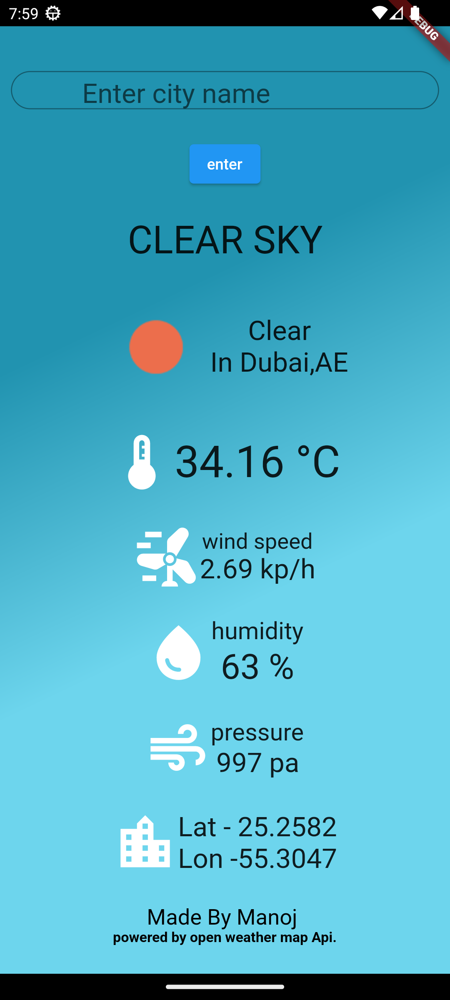
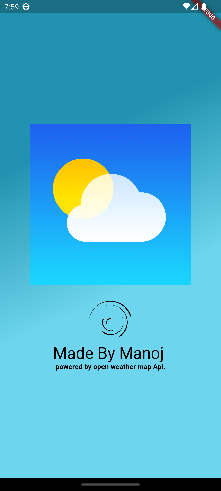
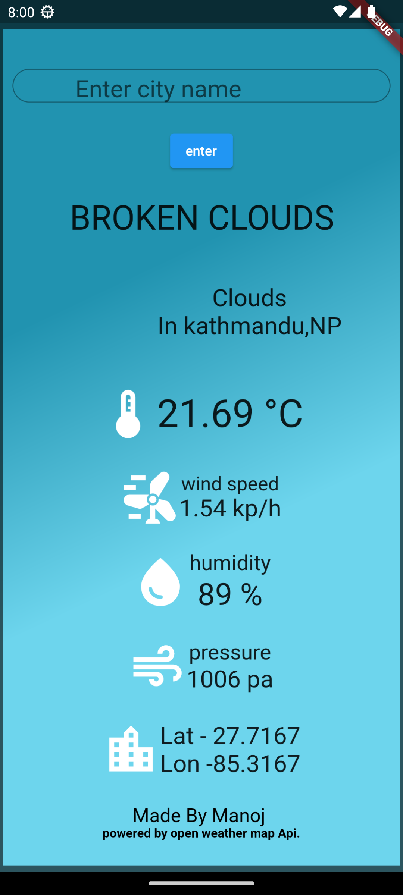

# Mausam

Mausam is a weather application developed using the Flutter framework, providing real-time weather information for locations worldwide. Whether you're planning a trip, need to know the forecast for your area, or simply curious about the weather conditions in different places, Mausam has you covered.

# Features

Real-time Weather Data: Mausam fetches the latest weather data from reliable sources(open weather map api) to ensure you have up-to-date and accurate information.

Location-based Forecast: Enter a city's name or allow the application to access your device's location to retrieve a detailed weather forecast for that area.

Current Conditions: Quickly view the current temperature, humidity, wind speed, and more with a single glance.

User-Friendly Interface: Mausam boasts a clean and intuitive design that ensures users of all ages can access weather information effortlessly.

# Technologies and Packages

Flutter: Mausam is developed using the Flutter framework, allowing for a single codebase across different platforms.

OpenWeather API: Weather data is fetched from the OpenWeather API, a reliable source for weather information.

http package: The http package is used to make HTTP requests to the OpenWeather API for fetching weather data.

SpinningKit: The SpinningKit package is utilized to display custom loading indicators during data fetching.

# Contribution

Contributions to Mausam are highly appreciated! Whether you discover bugs, wish to add new features, or enhance existing ones, please feel free to open an issue or submit a pull request on GitHub.

# security

because of security concerns i can't show my api key at github but you can get an api key in open weather map by creating an account
